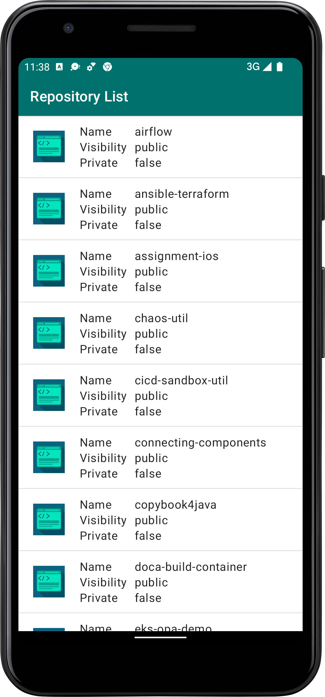
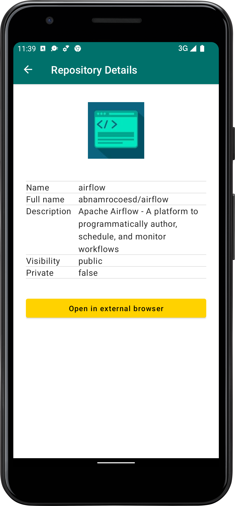

# Github Repository Browser
The Github Repository Browser will let you browse the Github Repositories.

## Project
Because of the Clean Architecture setup the project has 4 modules:

**App**
- contains the UI, which makes use of Jetpack Compose
- Responsible for navigation
- Dependency Injection
- Unit Tests

**Presentation**
- ViewModels

**Domain**
- UseCases
- Repository interfaces
- Domain models

**Data**
- Android specific implementation of the repositories.
- API
- Database
- Mappers

## Requirements

### Functional Requirements

- ***REQ-01:*** Create an app that shows ABN AMRO GitHub repositories.
- ***REQ-02:*** The App contains 2 screens; list screen and detail screen.
- ***REQ-03:*** The list screen shows (paginated) list of repos.
- ***REQ-04:*** The list screen shows the following data per item:
  - Name
  - Owner’s avatar image
  - Visibility
  - And if the repo is private or public
- ***REQ-05:*** Once a user clicks on an item on list screen, it opens the detail screen
- ***REQ-06:*** Detail screen shows:
  - Name
  - Full name
  - Description
  - Owner’s avatar image
  - Visibility
  - If the repo is private or public
  - And a CTA button which opens the html_url in an external browser
- ***REQ-07:*** CTA button which opens the html_url in an external browser
- ***REQ-08:*** You can use the following GitHub API:
  - https://api.github.com/users/abnamrocoesd/repos?page=1&per_page=10
- ***REQ-09:*** Make the app to cache the data in the database to be able to working (partly) offline.
- ***REQ-10:*** The cached data needs to be updated once the connection is available.

### Non-functional Requirements

- ***REQ-11:*** Code quality
- ***REQ-12:*** Use of modern libraries
- ***REQ-13:*** Testing

## Choices

- Dependency Injection: Koin, easy to implement, use and support for injecting dependencies in Composables.
- Architecture: Clean Architecture for optimal separation of concern and testability. Might be a lot of overhead for a small project but great for enterprise software.
- Compose: By exposing a single state from the ViewModel (almost in an MVVM-MVI hybrid approach) also simplifies our Composable layouts.
- In general choosing for modern libraries like Compose and the Architecture Components makes life easier for us Android Developers.

## Libraries

- Koin
- Kotlin
  - Coroutines
  - Serialization
- Jetpack
  - Compose
  - ViewModel
  - Paging
  - Room
- Coil
- MockK

## Future improvements

- Currently the repositories are cached in the database after they have been retrieved from the API, it is possible to use the app (partly) offline. But currently it doesn't work as it should in the image below:

[Paging Architecture](https://developer.android.com/topic/libraries/architecture/paging/v3-network-db)
- Testing and documentation can always be expanded and improved.
- CI/CD pipeline to keep track of quality.

### Build with
Android Studio Chipmunk | 2021.2.1
Build #AI-212.5712.43.2112.8512546, built on April 28, 2022
Runtime version: 11.0.12+0-b1504.28-7817840 aarch64
VM: OpenJDK 64-Bit Server VM by JetBrains s.r.o.
macOS 12.2
GC: G1 Young Generation, G1 Old Generation
Memory: 2048M
Cores: 10
Registry: external.system.auto.import.disabled=true
